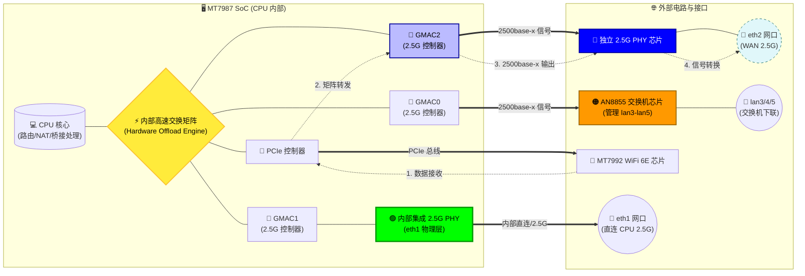

# Tenda BE12 Pro (BE7200 Ultra) ImmortalWrt-798x 固件

## 📝 概述
旨在为 **Tenda BE12 Pro (Tenda BE7200 Ultra)** 路由器构建基于 **ImmortalWrt-798x** 的轻量化固件。
- **核心特性**：启用 MTK_HNAT 及无线闭源驱动
- **平台**：MT7987_MT7992

## 🐛 已知问题
- **MU-MIMO 配置异常**
  - **现象**：在管理界面勾选“上下行 MU-MIMO"后，取消勾选无法**实质生效**。
  - **状态**：待修复。

- **Apple 设备断流问题**
  - **现象**：iPhone/iPad 等苹果设备连接后出现网络中断。
  - **日志报错**：类似 `peer_addba_rsp_action() 2965: wcid=12 TID=3 Token=5 add ori resrc fail`
  - **初步分析**：疑似 `HT_BAWinSize`设置过大，导致部分客户端兼容性异常。
  - **状态**：待修改参数测试。

- **eth2 网络重启失效问题**
  - **现象**：执行网络重启操作后，`eth2` 接口无法自动恢复，必须重启整个路由器方能生效。
  - **初步分析**：高度疑似 `airoha-en8811h` 驱动程序存在缺陷，导致接口状态重置异常。
  - **状态**：完全不会。

## ⚠️ 免责声明
> **重要提示**：
> 1. 本项目仅供技术研究与个人娱乐。
> 2. 本人**无任何**嵌入式、内核、C 语言、OpenWrt 开发经验。
> 3. 本固件基于社区大佬的代码库，结合 AI 辅助分析与验证整合而成。
> 4. **刷机有风险，操作需谨慎**。因刷写本固件导致的设备变砖、硬件损坏或数据丢失，本人概不负责。请大家自行评估风险。

## 🔧 固件刷入与使用指南

#### 📥 刷机教程
*   **详细步骤**：请参考 [Right Forum 原帖](https://www.right.com.cn/forum/thread-8463884-1-1.html)

#### 🔐 默认登录信息
刷入固件后，请使用以下默认账号密码登录：

| 项目 | 内容 |
| :--- | :--- |
| **用户名** | `root` |
| **密码** | `admin` |

#### 📊 使用体验反馈
*   **🌡️ 温度表现**：相比官方原厂固件，设备运行温度**有所下降**。
*   **📶 信号强度**：
    *   **5G 无线信号**：体感上与原厂固件**无异**。
    *   *注：后续将进行更详细的信号测试并更新数据。*

## 🔍 开发适配思路与方法论
针对缺乏底层开发经验的现状，采用“自底向上”的分析策略：

1.  **DTS 节点解析**：从设备树源文件 (`.dts`) 入手，逐行阅读并理解各节点定义的硬件功能及其关联关系。
2.  **硬件交互分析**：梳理 CPU 内部模块（GMAC, PCIe）与外部组件（交换机、PHY、无线网卡）的连接拓扑与通信机制。
3.  **架构可视化**：基于 DTS 分析结果，绘制硬件逻辑架构图，直观展示数据通路。
4.  **数据流推导**：根据架构图模拟数据流转路径（如：WiFi ↔ LAN/WAN），以此推导 HNAT 加速引擎与无线驱动在系统中的工作节点。
5.  **代码验证迭代**：定位关键配置文件（DTS, Config 等），进行修改、编译与真机验证，逐步完善功能。

## 🏗️ Tenda BE12 Pro 硬件架构分析

基于 MT7987 SoC 的数据流向与硬件连接示意如下：

## 🙏 鸣谢与参考资源
本项目站在巨人的肩膀上，特别感谢以下贡献者与开源项目：

| 贡献者/组织 | 参考链接 | 备注                                       |
| :--- | :--- |:-----------------------------------------|
| **padavanonly** | [GitHub: immortalwrt-mt798x-6.6](https://github.com/padavanonly/immortalwrt-mt798x-6.6/tree/mt798x-mt799x-6.6-mtwifi) | 代码库源头，项目基石                               |
| **igetmail** | [Right Forum Thread](https://www.right.com.cn/forum/thread-8463884-1-1.html) | 详尽的刷机保命指南，新手福音                           |
| **5252pt** | [OpenWrt PR #21461](https://github.com/openwrt/openwrt/pull/21461) | 推动 Tenda BE12 Pro 进入 OpenWrt 主线，设备DTS源头。 |
| **hanwckf** | [CMi Blog](https://cmi.hanwckf.top/p/immortalwrt-mt798x/) | MT798x 系列先行者，技术指引|