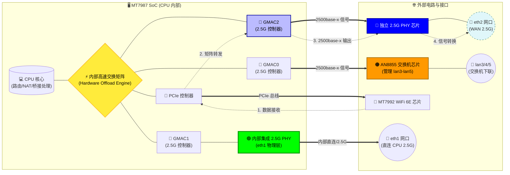

# Tenda BE12 Pro (BE7200 Ultra) ImmortalWrt-798x 固件

## 📝 概述
旨在为 **Tenda BE12 Pro (Tenda BE7200 Ultra)** 路由器构建基于 **ImmortalWrt-798x** 的轻量化固件。
- **核心特性**：启用 MTK_HNAT 及无线闭源驱动
- **平台**：MT7987_MT7992

## ⚠️ 免责声明
> **重要提示**：
> 1. 本项目仅供技术研究与个人娱乐。
> 2. 本人**无任何**嵌入式、内核、C 语言、OpenWrt 开发经验。
> 3. 本固件基于社区大佬的代码库，结合 AI 辅助分析与验证整合而成。
> 4. **刷机有风险，操作需谨慎**。因刷写本固件导致的设备变砖、硬件损坏或数据丢失，本人概不负责。请大家自行评估风险。

## 🔧 固件刷入与使用指南

#### 📥 刷机教程
*   **详细步骤**：请参考 [Right Forum 原帖](https://www.right.com.cn/forum/thread-8463884-1-1.html)

#### 🔐 默认登录信息
刷入固件后，请使用以下默认账号密码登录：

| 项目 | 内容 |
| :--- | :--- |
| **用户名** | `root` |
| **密码** | `admin` |

#### 📊 使用体验反馈
*   **🌡️ 温度表现**：相比官方原厂固件，设备运行温度**有所下降**。
*   **📶 无线速度**：
    *   **5G 无线速度**：体感上与原厂固件**无异**。

## 🏗️ Tenda BE12 Pro 硬件架构分析

基于 MT7987 SoC 的数据流向与硬件连接示意如下：

## 🙏 鸣谢与参考资源
本项目站在巨人的肩膀上，特别感谢以下贡献者与开源项目：

| 贡献者/组织 | 参考链接 | 备注                                       |
| :--- | :--- |:-----------------------------------------|
| **padavanonly** | [GitHub: immortalwrt-mt798x-6.6](https://github.com/padavanonly/immortalwrt-mt798x-6.6/tree/mt798x-mt799x-6.6-mtwifi) | 代码库源头，项目基石                               |
| **igetmail** | [Right Forum Thread](https://www.right.com.cn/forum/thread-8463884-1-1.html) | 详尽的刷机保命指南，新手福音                           |
| **5252pt** | [OpenWrt PR #21461](https://github.com/openwrt/openwrt/pull/21461) | 推动 Tenda BE12 Pro 进入 OpenWrt 主线，设备DTS源头。 |
| **hanwckf** | [CMi Blog](https://cmi.hanwckf.top/p/immortalwrt-mt798x/) | MT798x 系列先行者，技术指引|

